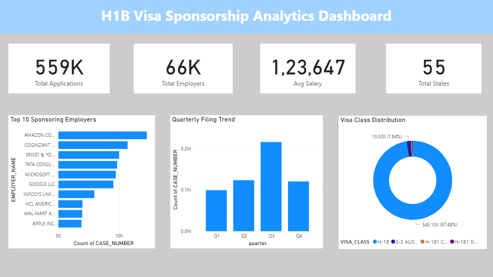
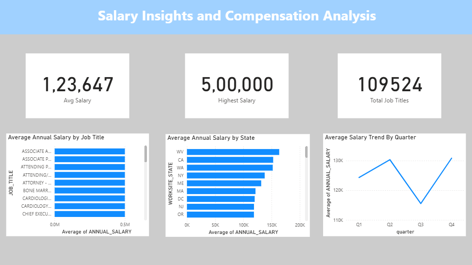
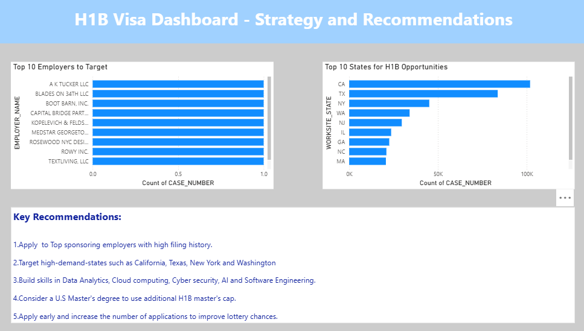

# H1B Visa Sponsorship Analytics Using Python, MySQL & Power BI

## Brief One Line Summary
A data analytics project that uses FY2024 H1B visa filing data to identify top employers, best states, salary trends, and strategies to improve sponsorship chances.

---

## Overview
The H1B visa program allows U.S. companies to hire foreign professionals in specialized roles such as software engineering, data science, cybersecurity, analytics, and cloud computing. Since H1B visas are limited and highly competitive, this project analyzes public LCA disclosure data to help applicants make better career decisions using data.

This project combines Python for data cleaning, MySQL for querying, and Power BI for dashboard reporting.

---

## Problem Statement
Many students and professionals want H1B sponsorship but do not know:

- Which companies sponsor the most candidates  
- Which states provide the best opportunities  
- Which roles pay the highest salaries  
- How to increase their chances of sponsorship  

This project solves these questions through real-world data analysis.

---

## Dataset
Source: U.S. Department of Labor – LCA Disclosure Data FY2024

Files Used:
- LCA_Disclosure_Data_FY2024_Q1.xlsx
- LCA_Disclosure_Data_FY2024_Q2.xlsx
- LCA_Disclosure_Data_FY2024_Q3.xlsx
- LCA_Disclosure_Data FY2024_Q4.xlsx

Raw Data:
- 561,037 rows
- 97 columns

Final Clean Dataset:
- 559,234 rows
- 26 columns

---

## Tools and Technologies

- Python
- Pandas
- NumPy
- MySQL
- SQLAlchemy
- PyMySQL
- Power BI
- Jupyter Notebook
- VS Code

---

## Project Structure

```text
H1B_Visas_Capstone/
│── data/
│   ├── raw/
│   │   ├── LCA_Disclosure_Data_FY2024_Q1.xlsx
│   │   ├── LCA_Disclosure_Data_FY2024_Q2.xlsx
│   │   ├── LCA Disclosure_Data_FY2024_Q3.xlsx
│   │   └── LCA Disclosure_Data_FY2024_Q4.xlsx
│   │
│   └── processed/
│       └── h1b_clean_2024.csv
│
│── notebooks/
│   ├── 01_data_loading.ipynb
│   ├── 02_data_cleaning.ipynb
│   ├── 03_sql_setup.ipynb
│   └── 04_sql_analysis.ipynb
│
│── scripts/
│   ├── load_data.py
│   ├── clean_data.py
│   ├── export_to_sql.py
│   └── run_pipeline.py
│
│── sql/
│   ├── create_database.sql
│   ├── create_table.sql
│   └── analysis_queries.sql
│
│── dashboard/
│   ├── H1B_Dashboard.pbix
│   └── screenshots/
│       ├── page1.png
│       ├── page2.png
│       └── page3.png
│
│── reports/
│   ├── H1B_Presentation.pptx
│   ├── H1B_Project_Report.docx
│   └── H1B_Executive_Summary.pdf
│
└── README.md

---

## Methods

### 1. Data Loading
Loaded all four quarterly Excel files into Pandas.

### 2. Data Cleaning
- Selected relevant columns
- Removed duplicates
- Fixed missing values
- Converted dates and numeric fields
- Standardized text columns

### 3. Feature Engineering
Created `ANNUAL_SALARY` by converting hourly, weekly, monthly, and yearly wages into annual salary.

### 4. SQL Analysis
Performed SQL queries to analyze:
- Top employers
- Highest paying roles
- State opportunities
- Salary trends
- Filing patterns

### 5. Dashboard Creation
Built a 3-page Power BI dashboard.

---

## Key Insights

- Top employers sponsor a major share of H1B filings
- California, Texas, New York, and Washington lead in opportunities
- Technical roles offer higher salaries
- AI, Data, Cloud, and Cybersecurity skills are highly valuable
- Filing patterns vary across quarters

---

## Dashboard / Model / Output

### Page 1: Overview
- Total Applications
- Total Employers
- Average Salary
- Top Employers
- Quarterly Trends
- Visa Distribution


### Page 2: Salary Insights
- Highest Salary
- Salary by Job Title
- Salary by State
- Salary Trend by Quarter


### Page 3: Strategy & Recommendations
- Top Employers to Target
- Best States for Opportunities
- Career Recommendations


---

## How to Run this project?

### Step 1
Clone or download the repository.

### Step 2
Install the required libraries:

```bash
pip install pandas numpy sqlalchemy pymysql openpyxl


Step 3
Run the pipeline script:

```bash 
python scripts/run_pipeline.py

Step 4
Open Power BI dashboard:

dashboard/H1B_Dashboard.pbix

---

## Results & Conclusion
This project transforms public H1B filing data into practical career guidance. By using analytics, applicants can identify the best employers, target the right states, develop valuable skills, and make smarter decisions to improve sponsorship opportunities.

---

## Future Work
Predict H1B sponsorship success using Machine Learning
Add previous years' data for trend comparison
Build web dashboard using Streamlit or Flask
Integrate live job posting APIs
Analyze employer approval ratios

---

## Author & Contact

Author: Mahin Fatma
Project: H1B Visa Sponsorship Analytics Capstone
Tools: Python | MySQL | Power BI